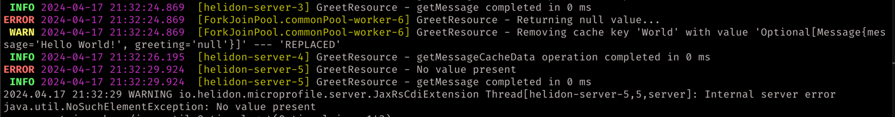

# caffeine-poc

A POC for figuring out how caffeine cache works. This is built over [Helidon MP Quickstart](https://helidon.io/docs/v3/mp/guides/quickstart) project with me using [GitHub - ben-manes/caffeine: A high performance caching library for Java](https://github.com/ben-manes/caffeine) library and some loggers (SLF4J and Log4j2).

## Colored Logs (Log4j2 and SLF4J)



## Refresh and Expire behavior

For a cache defined as follows
```java
private LoadingCache<String,String> messageCache = Caffeine.newBuilder()
        .expireAfterWrite(2, TimeUnit.MINUTES)
        .refreshAfterWrite(1,TimeUnit.MINUTES)
        .evictionListener((key,value,reason) -> {
            LOGGER.warn("Expiring cache key '{}' with value '{}' --- '{}'",key,value,reason);
        })
        .removalListener((key,value,reason) -> {
            LOGGER.warn("Removing cache key '{}' with value '{}' --- '{}'",key,value,reason) ;
        })
        .recordStats()
        .build(this::makeMessage);

/**
 * Simulates the behavior of a function which takes "too" much time to calculate data
 * Cachine is supposed to reduce the calls to this function
 * @param message   : String
 * @return  Customised message
 * @throws  InterruptedException
 */
private String makeMessage(String message) throws InterruptedException {
        LOGGER.warn("Could not find value for {} key in cache. Building....",message);
        LOGGER.info("Making current thread sleep for {} seconds",3);
        Thread.sleep(3000);
        return String.format("%s + %s",message,message.length());
        }
            
```

- If the value does not exist in cache, cache uses the loading function (in this case, `makeMessage()`) to build a new value and return it
- Access to the same value before the refresh interval is instantly returned. The eligibility for "being refreshed" is checked each time the value is accessed. 
- If we have accessed the value after it has been marked for refresh, cache returns the value and asynchronously loads a new value
- If we have accessed the value after it has been marked for expiry, it is evicted from the cache and a new value is loaded. **Also, when this value is evicted, cache performs a maintenance task in a separate thread which evicts all the values which have been marked for expiry**

> Eviction         : eviction means removal due to the policy (like, expireAfterAccess or expireAfterWrite)

> Invalidation     : invalidation means manual removal by the caller

> Removal          : removal occurs as a consequence of invalidation or eviction _(If a value is refreshed, it is marked as `REPLACED` and is considered a removal)_

## Getting exceptions while trying to reload the value in Cache

Let's say that we have a value in cache which now, cannot be reloaded for some reason (for example, we were storing a user's information but now that user has been deleted). In such a scenario, the behavior of cache is as follows

- Before the refresh interval, if a value (let's call it `x`) is accessed, then we will get the value
- After the refresh interval (and before the expiry interval), if we are not able to access `x` and the loading function (the function which gives us the value we need) throws an Exception, it will be logged in console and the cache will return its existing value
- After the expiry interval, if we are not able to access `x` and if the loading function (the function which gives us the value we need) 
  - Throws an Exception : It will be logged in console and the cache will return empty value.
  - Returns a `null` value : It will remove the entry itself (an "EXPLICIT" removal) and since the loading function is returning null, each time that "key" is accessed, loader will try to load this into the cache 
  - Returns an `Optional` : If you are returning an Optional value without checking whether it is null or not (like, `messageCache.get(name).get()`), then if the cache contains a `Optional.empty` with the provided key, it will throw an error. **Also, unlike `null`, it will keep a value in cache (`Optional.empty`) and will call loading function only when it reaches its refreshing interval.**
- If we access any value other than `x` (let's call it `y`), then we will face no issues
- If `y` is accessed after the expiry interval, then it will get evicted and if `x` is eligible to be evicted (because of expiry), then `x` will be evicted as well

# Info provided by helidon and me

## Build and run
With JDK17+

If you have helidon cli tool installed, it is easy
```bash
# Use Remote JVM Debug to attach yourself to port 7044
helidon dev --app-debug --app-debug-no-wait --app-debug-port 7044 --verbose
```

If you just have maven, use the following commands
```bash
mvn package
java -jar target/caffeine-poc.jar

# To run in debug mode and skip tests
# Use Remote JVM Debug on port 7044
mvn package -DskipTests ;
java -Xdebug -Xrunjdwp:transport=dt_socket,server=y,suspend=n,address=7044  -jar target/caffeine-poc.jar ;

# Do it in one line 
mvn package -DskipTests && java -Xdebug -Xrunjdwp:transport=dt_socket,server=y,suspend=n,address=7044  -jar target/caffeine-poc.jar


```

## Usage

```bash
curl -X GET http://localhost:8081/greet
{"message":"Hello World!"}

curl -X GET http://localhost:8081/greet/Joe
{"message":"Hello Joe!"}

curl -X PUT -H "Content-Type: application/json" -d '{"greeting" : "Hola"}' http://localhost:8081/greet/greeting

curl -X GET http://localhost:8081/greet/Jose
{"message":"Hola Jose!"}
```